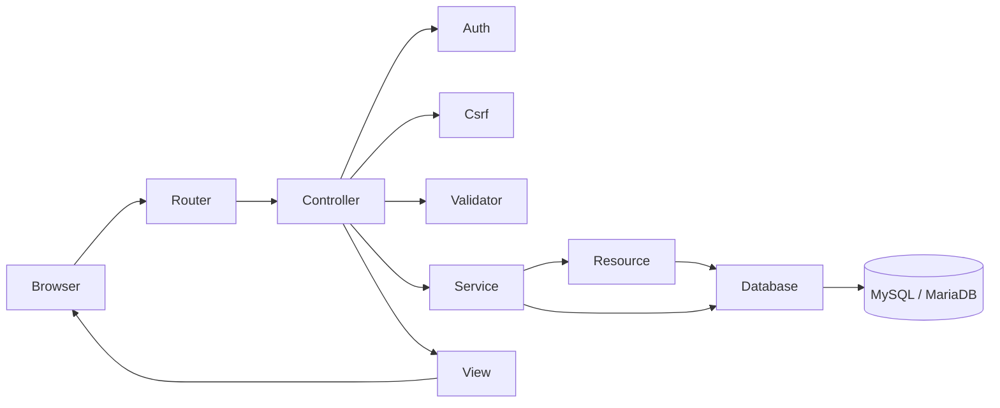

# Arsitektur dan keputusan implementasi

## Alur request

`public/index.php` memuat bootstrap dan router, lalu memanggil controller. Controller melakukan autentikasi/role dan CSRF sebelum mutasi. Validator membuat allowlist data bersih. ResourceService atau InventoryService menjalankan operasi bisnis. Model Resource dan Database mengakses PDO. Controller menghasilkan view HTML atau envelope JSON.

## OOP yang dapat ditunjukkan

| Konsep | Implementasi nyata | Penjelasan |
|---|---|---|
| Class dan object | `new Resource('barang')` | Object mempunyai metadata khusus satu modul. |
| Constructor | Resource / HttpException | Dependensi dan kondisi object diatur saat dibuat. |
| Encapsulation | Database::$connection, Router::$routes | State internal bersifat private. |
| Inheritance | AuthController extends Controller | Controller berbagi render view dan JSON. |
| Composition | ResourceService memakai InventoryService/UploadService | Tanggung jawab stok dan foto dipisah. |
| Reusable helper | Validator, Csrf, fungsi e | Validasi/escape konsisten pada semua modul. |
| Exception | HttpException dan PDOException mapping | Business error diterjemahkan menjadi respons yang aman. |

Interface tidak dipaksakan karena hanya ada satu driver penyimpanan. Class terpisah per barang/gudang/supplier tidak dibuat karena perilaku master identik; metadata allowlist mencegah pengulangan query dan view. Logika stok tetap berada pada class tersendiri, tidak di view.

## Konsistensi stok

Invariant: `barang.stok = SUM(barang_masuk.jumlah) - SUM(barang_keluar.jumlah)`.

1. Begin transaction.
2. Jika edit/hapus, kunci baris transaksi lama dengan `FOR UPDATE`.
3. Hitung delta pembalik lama dan delta baru; gabungkan jika barang sama.
4. Urutkan ID barang, kunci barang satu per satu dengan `FOR UPDATE`.
5. Hitung stok akhir, tolak jika <0 atau >2 miliar.
6. Simpan stok, transaksi, dan audit dalam transaksi database yang sama.
7. Commit; exception menyebabkan rollback keseluruhan.

Contoh masuk 10, keluar 4 → saldo 6. Edit masuk menjadi 12 → `6 - 10 + 12 = 8`. Hapus masuk saat ada keluar ditolak karena `8 - 12 < 0`. Hapus keluar 4 → `8 + 4 = 12`.

Deadlock/lock timeout ditampilkan sebagai konflik 409 dan pengguna dapat mengulang. Nomor transaksi menggabungkan tanggal/waktu dengan random 10 digit heksadesimal dan dilindungi UNIQUE.

## Kebijakan dan batas lingkup

- Satu barang berada di satu gudang; tidak ada stok per batch, harga, valuasi, reservasi, atau transfer antargudang khusus.
- Nama/kategori/gudang pada laporan mengikuti master terkini. Laporan historis snapshot tidak termasuk lingkup.
- Semua tabel daftar memakai DataTables client-side. Server mengirim seluruh data, tanpa pagination server ganda. Cocok untuk demo/persediaan kecil; untuk puluhan ribu baris, tambahkan endpoint server-side DataTables.
- API GET memerlukan sesi login atau Bearer token; API mutasi hanya token Admin. CSRF mutasi selalu diverifikasi, termasuk API.
- Export GET tidak mengubah bisnis/data, sehingga tidak memerlukan CSRF; akses Admin tetap diperiksa.
- File foto privat di `storage/uploads`, nama random PNG, disajikan oleh route terautentikasi. Asset publik tidak menerima upload.
- User di-nonaktifkan; audit append-only dari UI. Administrator database tetap memiliki kemampuan teknis mengubah database.
- Statistik total stok menjumlahkan satuan berbeda sebagai indikator jumlah administratif.
- Filter tanggal pada laporan stok tidak berlaku; saldo saat ini dijelaskan pada UI dan export.

## Pola URL

GET `/{resource}` daftar, GET `/{resource}/create`, POST `/{resource}`, GET `/{resource}/{id}`, GET `/{resource}/{id}/edit`, POST `/{resource}/{id}`, POST `/{resource}/{id}/delete`. Form HTML memakai POST; API memakai GET/POST/PUT/DELETE sesuai REST. Tidak ada mutasi melalui GET.

## Lapisan baca dan antarmuka teknologi

`BarangQuery` menyatukan validasi dan query pencarian, kategori, gudang, serta status untuk halaman Barang dan REST. Semua filter beririsan (AND); nilai pengguna tetap menjadi parameter PDO. `DashboardService` menambah agregat gudang/kesehatan dan rentang 6/12/YTD tanpa mengubah mutasi stok. `InventoryPresentation` memilih status dan foto/placeholder SVG; tidak menyimpan saldo.

JavaScript dipisah menjadi `app.js` (shell, DataTables umum, konfirmasi, Fetch stok), `dashboard.js` (Fetch dan Chart.js), dan `inventory-view.js` (tabel/galeri dan preferensi). Galeri mengikuti baris halaman aktif DataTables sehingga pencarian, urutan, dan pagination sama. Legend berupa tautan menyediakan alternatif keyboard untuk klik grafik.

Skema, relasi, InventoryService, otorisasi, dan export tidak diubah oleh penyegaran UI. Diagram domain tetap berlaku. Referensi GitHub hanya untuk pola informasi, tanpa menyalin backend atau aset.
