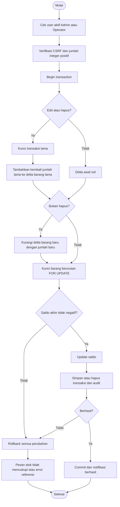

# Activity Barang Keluar

```mermaid
flowchart TD
    A([Mulai]) --> B[Cek user aktif Admin atau Operator]
    B --> C[Verifikasi CSRF dan jumlah integer positif]
    C --> D[Begin transaction]
    D --> E{Edit atau hapus?}
    E -- Ya --> F[Kunci transaksi lama]
    F --> G[Tambahkan kembali jumlah lama ke delta barang lama]
    E -- Tidak --> H[Delta awal nol]
    G --> I{Bukan hapus?}
    H --> I
    I -- Ya --> J[Kurangi delta barang baru dengan jumlah baru]
    I -- Tidak --> K[Kunci barang berurutan FOR UPDATE]
    J --> K
    K --> L{Saldo akhir tidak negatif?}
    L -- Tidak --> R[Rollback semua perubahan]
    L -- Ya --> M[Update saldo]
    M --> N[Simpan atau hapus transaksi dan audit]
    N --> O{Berhasil?}
    O -- Tidak --> R
    O -- Ya --> P[Commit dan notifikasi berhasil]
    P --> T([Selesai])
    R --> S[Pesan stok tidak mencukupi atau error referensi]
    S --> T
```
