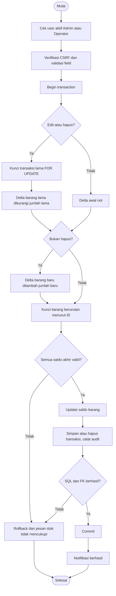

# Activity Barang Masuk

```mermaid
flowchart TD
    A([Mulai]) --> B[Cek user aktif Admin atau Operator]
    B --> C[Verifikasi CSRF dan validasi field]
    C --> D[Begin transaction]
    D --> E{Edit atau hapus?}
    E -- Ya --> F[Kunci transaksi lama FOR UPDATE]
    E -- Tidak --> G[Delta awal nol]
    F --> H[Delta barang lama dikurangi jumlah lama]
    G --> I{Bukan hapus?}
    H --> I
    I -- Ya --> J[Delta barang baru ditambah jumlah baru]
    I -- Tidak --> K[Kunci barang berurutan menurut ID]
    J --> K
    K --> L{Semua saldo akhir valid?}
    L -- Tidak --> R[Rollback dan pesan stok tidak mencukupi]
    L -- Ya --> M[Update saldo barang]
    M --> N[Simpan atau hapus transaksi, catat audit]
    N --> O{SQL dan FK berhasil?}
    O -- Tidak --> R
    O -- Ya --> P[Commit]
    P --> S[Notifikasi berhasil]
    S --> T([Selesai])
    R --> T
```
