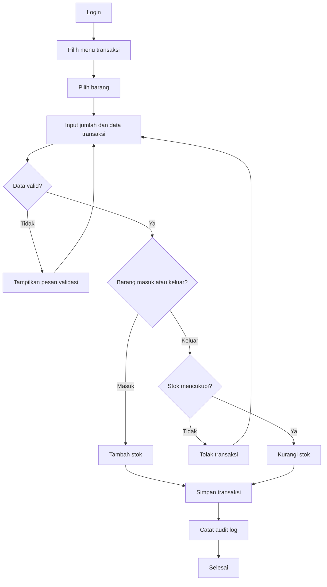

# Activity Diagram Transaksi Inventori

Diagram ini memperlihatkan alur praktis transaksi barang masuk dan barang keluar pada SIM Inventory.

```mermaid
flowchart TD
    A[Login] --> B[Pilih menu transaksi]
    B --> C[Pilih barang]
    C --> D[Input jumlah dan data transaksi]
    D --> E{Data valid?}
    E -- Tidak --> F[Tampilkan pesan validasi]
    F --> D
    E -- Ya --> G{Barang masuk atau keluar?}
    G -- Masuk --> H[Tambah stok]
    G -- Keluar --> I{Stok mencukupi?}
    I -- Tidak --> J[Tolak transaksi]
    J --> D
    I -- Ya --> K[Kurangi stok]
    H --> L[Simpan transaksi]
    K --> L
    L --> M[Catat audit log]
    M --> N[Selesai]
```
