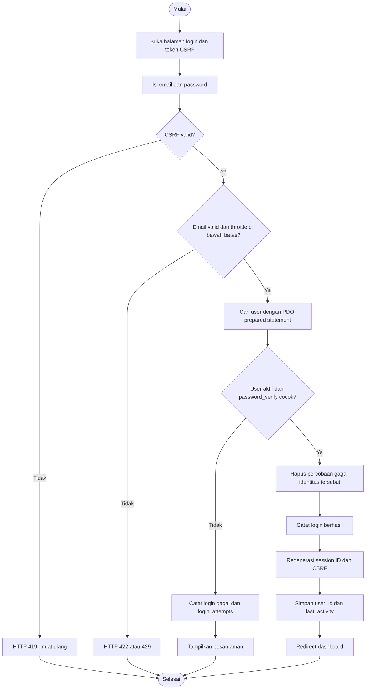

# Activity Login

```mermaid
flowchart TD
    A([Mulai]) --> B[Buka halaman login dan token CSRF]
    B --> C[Isi email dan password]
    C --> D{CSRF valid?}
    D -- Tidak --> E[HTTP 419, muat ulang]
    D -- Ya --> F{Email valid dan throttle di bawah batas?}
    F -- Tidak --> G[HTTP 422 atau 429]
    F -- Ya --> H[Cari user dengan PDO prepared statement]
    H --> I{User aktif dan password_verify cocok?}
    I -- Tidak --> J[Catat login gagal dan login_attempts]
    J --> K[Tampilkan pesan aman]
    I -- Ya --> L[Hapus percobaan gagal identitas tersebut]
    L --> M[Catat login berhasil]
    M --> N[Regenerasi session ID dan CSRF]
    N --> O[Simpan user_id dan last_activity]
    O --> P[Redirect dashboard]
    P --> Q([Selesai])
    E --> Q
    G --> Q
    K --> Q
```
