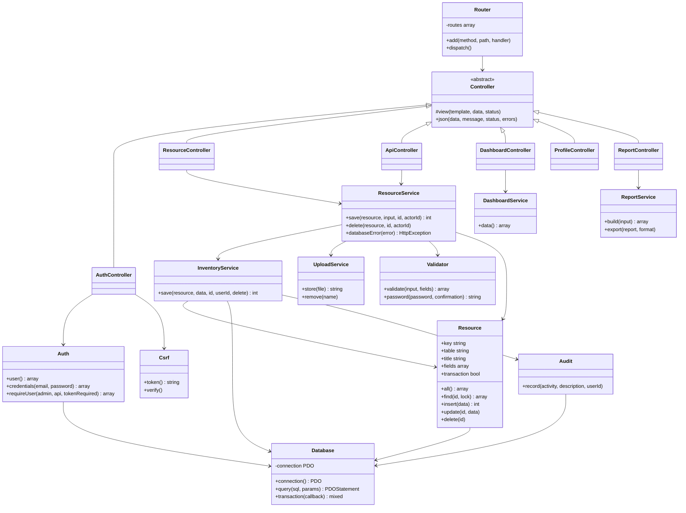

# Class Diagram

Diagram kelas utama sesuai implementasi. Tipe/helper tambahan dijelaskan di ARCHITECTURE.

```mermaid
classDiagram
    class Database {
        -connection PDO
        +connection() PDO
        +query(sql, params) PDOStatement
        +transaction(callback) mixed
    }
    class Router {
        -routes array
        +add(method, path, handler)
        +dispatch()
    }
    class Controller {
        <<abstract>>
        #view(template, data, status)
        +json(data, message, status, errors)
    }
    class Resource {
        +key string
        +table string
        +title string
        +fields array
        +transaction bool
        +all() array
        +find(id, lock) array
        +insert(data) int
        +update(id, data)
        +delete(id)
    }
    class ResourceService {
        +save(resource, input, id, actorId) int
        +delete(resource, id, actorId)
        +databaseError(error) HttpException
    }
    class InventoryService {
        +save(resource, data, id, userId, delete) int
    }
    class Auth {
        +user() array
        +credentials(email, password) array
        +requireUser(admin, api, tokenRequired) array
    }
    class Csrf {
        +token() string
        +verify()
    }
    class Validator {
        +validate(input, fields) array
        +password(password, confirmation) string
    }
    class UploadService {
        +store(file) string
        +remove(name)
    }
    class ReportService {
        +build(input) array
        +export(report, format)
    }
    class DashboardService {
        +data() array
    }
    class Audit {
        +record(activity, description, userId)
    }
    Controller <|-- AuthController
    Controller <|-- ResourceController
    Controller <|-- ApiController
    Controller <|-- DashboardController
    Controller <|-- ProfileController
    Controller <|-- ReportController
    ResourceController --> ResourceService
    ApiController --> ResourceService
    ResourceService --> InventoryService
    ResourceService --> UploadService
    ResourceService --> Validator
    ResourceService --> Resource
    InventoryService --> Resource
    InventoryService --> Database
    InventoryService --> Audit
    Resource --> Database
    Auth --> Database
    Audit --> Database
    ReportController --> ReportService
    DashboardController --> DashboardService
    Router --> Controller
    AuthController --> Auth
    AuthController --> Csrf
```
