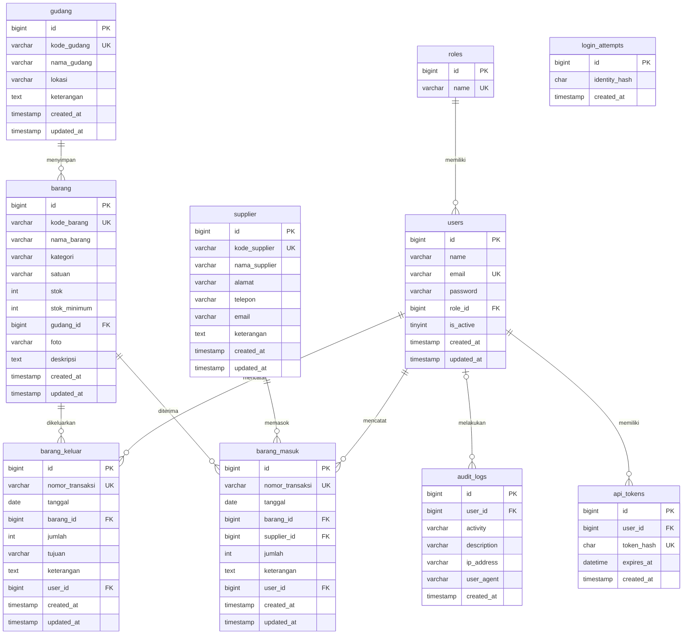

# Entity Relationship Diagram

Sesuai `database/schema.sql`. Semua tabel InnoDB, PK BIGINT UNSIGNED; FK RESTRICT kecuali audit user SET NULL dan api_tokens CASCADE.

`login_attempts` tidak mempunyai FK user karena percobaan gagal dapat berasal dari email yang belum terdaftar. Identity hash mewakili kombinasi IP dan email.
