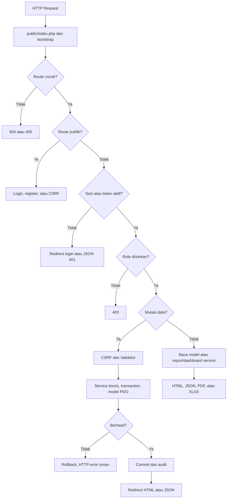

# Flowchart Sistem

```mermaid
flowchart TD
    A[HTTP Request] --> B[public/index.php dan bootstrap]
    B --> C{Route cocok?}
    C -- Tidak --> D[404 atau 405]
    C -- Ya --> E{Route publik?}
    E -- Ya --> F[Login, register, atau CSRF]
    E -- Tidak --> G{Sesi atau token aktif?}
    G -- Tidak --> H[Redirect login atau JSON 401]
    G -- Ya --> I{Role diizinkan?}
    I -- Tidak --> J[403]
    I -- Ya --> K{Mutasi data?}
    K -- Ya --> L[CSRF dan Validator]
    L --> M[Service bisnis, transaction, model PDO]
    K -- Tidak --> N[Baca model atau report/dashboard service]
    M --> O{Berhasil?}
    O -- Tidak --> P[Rollback, HTTP error aman]
    O -- Ya --> Q[Commit dan audit]
    Q --> R[Redirect HTML atau JSON]
    N --> S[HTML, JSON, PDF, atau XLSX]
```
