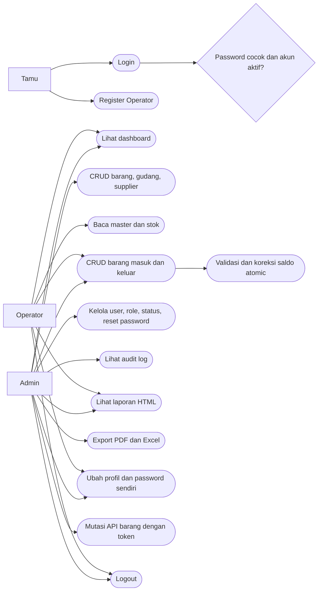

# Use Case

Mermaid flowchart berikut merepresentasikan aktor dan use case; bukan notasi UML use-case native.

```mermaid
flowchart LR
    Tamu["Tamu"] --> Login([Login])
    Tamu --> Register([Register Operator])
    Admin["Admin"] --> Dashboard([Lihat dashboard])
    Operator["Operator"] --> Dashboard
    Admin --> Master([CRUD barang, gudang, supplier])
    Operator --> Read([Baca master dan stok])
    Admin --> Transaksi([CRUD barang masuk dan keluar])
    Operator --> Transaksi
    Admin --> User([Kelola user, role, status, reset password])
    Admin --> Audit([Lihat audit log])
    Admin --> Report([Lihat laporan HTML])
    Operator --> Report
    Admin --> Export([Export PDF dan Excel])
    Admin --> Profil([Ubah profil dan password sendiri])
    Operator --> Profil
    Admin --> API([Mutasi API barang dengan token])
    Admin --> Logout([Logout])
    Operator --> Logout
    Login --> Validasi{Password cocok dan akun aktif?}
    Transaksi --> Stok([Validasi dan koreksi saldo atomic])
```
